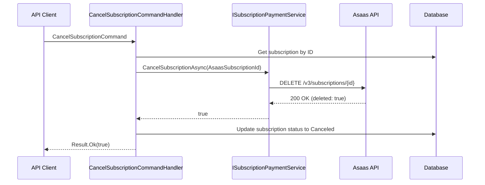
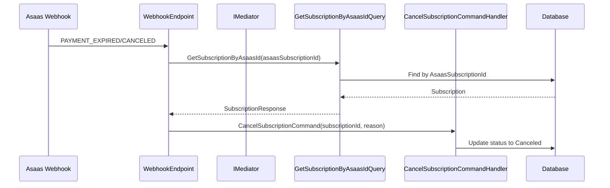

# Subscription Cancellation Flow

## Overview

This document describes the complete flow for canceling a driver subscription in the TILT platform. The cancellation process involves both local database updates and external API calls to Asaas (payment provider).

## Flow Diagram



## Components

### 1. CancelSubscriptionCommand

**Location:** `Application/Features/Subscriptions/Commands/CancelSubscription/CancelSubscriptionCommand.cs`

```csharp
public sealed record CancelSubscriptionCommand(
    long subscriptionId,
    string? reason = null
) : ICommand<Result<bool>>;
```

### 2. CancelSubscriptionCommandHandler

**Location:** `Application/Features/Subscriptions/Commands/CancelSubscription/CancelSubscriptionCommandHandler.cs`

**Responsibilities:**
1. Validate subscription exists and is in a cancellable state (Active or PendingApproval)
2. Call Asaas API to cancel the subscription remotely
3. Update local database with Canceled status
4. Log the cancellation with optional reason

**Cancellation Rules:**
- Only subscriptions with `Status == Active` or `Status == PendingApproval` can be canceled
- If Asaas cancellation fails, local cancellation still proceeds (graceful degradation)

### 3. ISubscriptionPaymentService

**Location:** `Application/Shared/Abstractions/IDriverPaymentService.cs`

**Method:**
```csharp
Task<bool> CancelSubscriptionAsync(string asaasSubscriptionId, CancellationToken cancellationToken = default);
```

### 4. DriverPaymentService

**Location:** `Infrastructure/External/Features/Payments/Services/DriverPaymentService.cs`

**Implementation:**
- Makes DELETE request to `v3/subscriptions/{asaasSubscriptionId}`
- Returns `true` on success, `false` on failure
- Logs all operations

## Webhook Integration

### Payment Expiration/Cancellation Webhook

**Location:** `Api/Endpoints/WebhookEndpoint.cs`

When Asaas sends `PAYMENT_EXPIRED` or `PAYMENT_CANCELED` events:



## Database Schema

### Subscription Entity

```csharp
public class Subscription : Entity
{
    public long UserId { get; protected set; }
    public long PlanId { get; protected set; }
    public SubscriptionStatus Status { get; protected set; }
    public SubscriptionType SubscriptionType { get; protected set; }
    public string? AsaasSubscriptionId { get; protected set; }  // Key for Asaas lookup
    public string? AsaasPaymentId { get; protected set; }
    public string? AsaasPaymentLink { get; protected set; }
    public DateTime? PaidAt { get; protected set; }
}
```

### SubscriptionStatus Enum

```csharp
public enum SubscriptionStatus
{
    PendingApproval,  // Initial state after creation
    Active,           // Payment confirmed
    Canceled,         // User or system canceled
    Suspended         // Payment failed
}
```

## API Endpoints

### Cancel Subscription (Direct)

```
POST /subscriptions/cancel
Content-Type: application/json

{
    "subscriptionId": 123,
    "reason": "User requested cancellation"
}
```

### Webhook Endpoint (Asaas)

```
POST /webhooks/asaas
Content-Type: application/json

{
    "event": "PAYMENT_EXPIRED",
    "payment": {
        "id": "pay_123",
        "subscription": "sub_abc"  // AsaasSubscriptionId
    }
}
```

## Error Handling

| Scenario | Behavior |
|----------|----------|
| Subscription not found | Returns `Result.Fail("Subscription not found")` |
| Invalid status (not Active/PendingApproval) | Returns `Result.Fail("Cannot cancel subscription in current status")` |
| Asaas API failure | Logs warning, continues with local cancellation |
| Database error | Returns `Result.Fail` with exception message |

## Testing Considerations

1. **Unit Tests:**
   - Test cancellation with valid subscription
   - Test cancellation with invalid status
   - Test cancellation when subscription not found
   - Test Asaas API failure handling

2. **Integration Tests:**
   - Test full flow with mock Asaas API
   - Test webhook flow with expired payment

## Related Files

- `Application/Features/Subscriptions/Commands/CancelSubscription/`
- `Application/Features/Subscriptions/Queries/GetSubscriptionByAsaasId/`
- `Infrastructure/External/Features/Payments/Services/DriverPaymentService.cs`
- `Api/Endpoints/WebhookEndpoint.cs`
- `Domain/Features/Subscriptions/Entities/Subscription.cs`