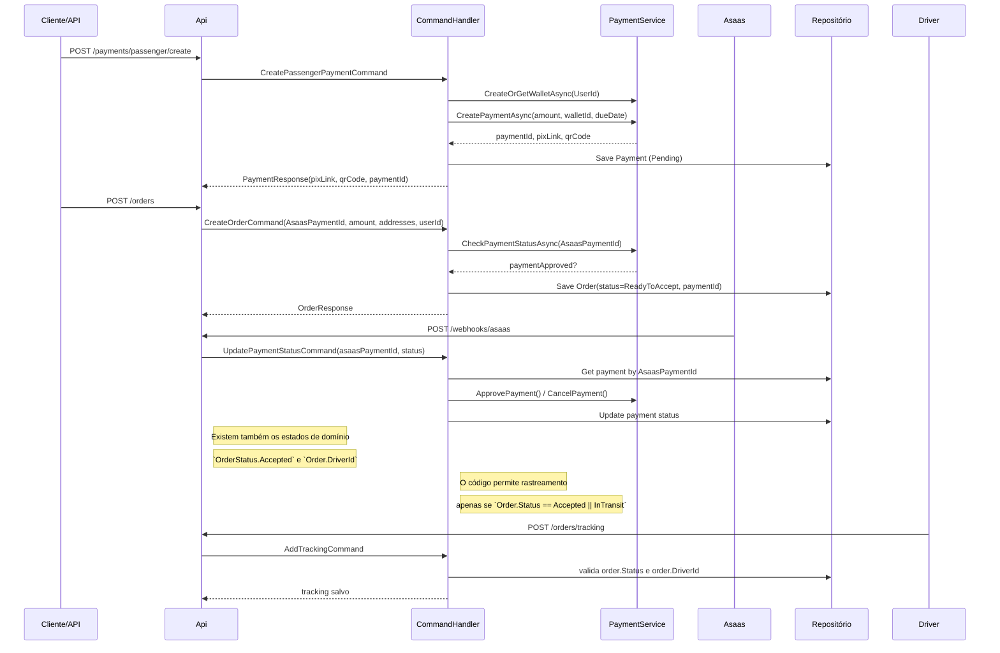

# Fluxo Real Existente: Criação de Order, Pagamento e Aceitação

Este diagrama usa apenas os endpoints e handlers presentes no repositório atual.

## Observações

- O endpoint `POST /payments/passenger/create` existe no arquivo `Api/Endpoints/PaymentsEndpoint.cs`.
- O endpoint `POST /orders` existe em `Api/Endpoints/OrdersEndpoint.cs`.
- O webhook `POST /webhooks/asaas` existe em `Api/Endpoints/WebhookEndpoint.cs`.
- O projeto atual não expõe um endpoint explícito de "aceitação de motorista"; o domínio já possui o estado `OrderStatus.Accepted` e o `DriverId` no pedido.
- A regra de aceitação implícita é refletida em `Application/Features/Orders/Commands/AddTracking/AddTrackingCommandHandler.cs`, que só permite tracking para pedidos `Accepted` ou `InTransit`.
