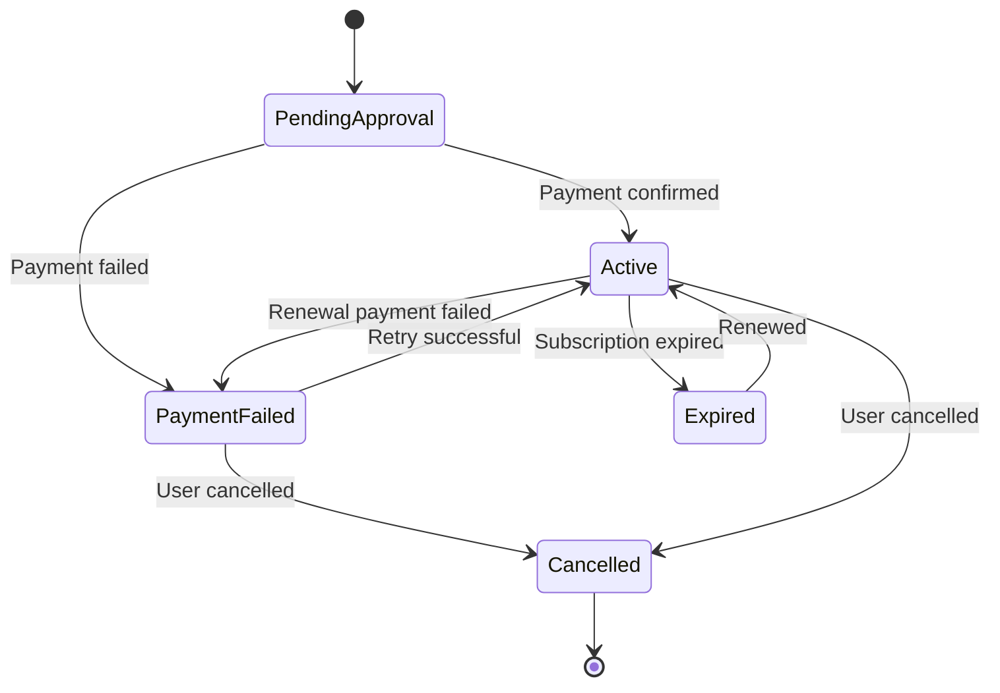

# Data Model: Unify Subscriptions

**Date**: 2026-05-03  
**Feature**: 002-unify-subscriptions  
**Purpose**: Define the unified data model for Subscription entity after unification.

## Entity: Subscription (Unified)

### Attributes

| Property | Type | Nullable | Description | Source |
|----------|------|-----------|-------------|--------|
| Id | long | No | Primary key (inherited from Entity) | Existing |
| UserId | long | No | Foreign key to users table | Existing |
| PlanId | long | No | Foreign key to plans table | Existing |
| Status | SubscriptionStatus | No | Current status (PendingApproval, Active, Cancelled, Expired, PaymentFailed) | Existing |
| SubscriptionType | SubscriptionType | No | Type of subscription (Driver, Passenger) | **NEW** |
| DueDate | DateTime | No | Next payment due date | Existing |
| PaymentToken | string? | Yes | Payment token for processing | Existing |
| AsaasPaymentId | string? | Yes | Asaas payment ID | **FROM DriverSubscription** |
| AsaasPaymentLink | string? | Yes | Asaas payment link URL | **FROM DriverSubscription** |
| AsaasSubscriptionId | string? | Yes | Asaas subscription ID | **FROM DriverSubscription** |
| PaidAt | DateTime? | Yes | When payment was made | **FROM DriverSubscription** |
| CreatedAt | DateTime | No | Creation timestamp (inherited from Entity) | Existing |
| UpdatedAt | DateTime | No | Last update timestamp (inherited from Entity) | Existing |

### Relationships

| Relationship | Type | Description |
|--------------|------|-------------|
| User | Many-to-One | Subscription belongs to a User (driver or passenger) |
| Plan | Many-to-One | Subscription belongs to a Plan |

### Validation Rules

1. **UserId**: Required, must exist in users table
2. **PlanId**: Required, must exist in plans table
3. **Status**: Must be a valid `SubscriptionStatus` value
4. **SubscriptionType**: Must be a valid `SubscriptionType` value (Driver or Passenger)
5. **DueDate**: Must be a future date (>= CreatedAt)
6. **Uniqueness**: Only one active subscription per UserId + SubscriptionType combination

### State Transitions



### Enum: SubscriptionType

```csharp
namespace Domain.Subscriptions.Enums;

public enum SubscriptionType
{
    Driver = 1,
    Passenger = 2
}
```

### Enum: SubscriptionStatus (Updated)

```csharp
namespace Domain.Subscriptions.Enums;

public enum SubscriptionStatus
{
    PendingApproval = 1,
    Active = 2,
    Cancelled = 3,
    Expired = 4,
    PaymentFailed = 5  // NEW: Added for payment failure handling
}
```

## Database Schema (PostgreSQL)

### Table: `tilt.subscriptions` (Updated)

```sql
CREATE TABLE tilt.subscriptions (
    id BIGSERIAL PRIMARY KEY,
    user_id BIGINT NOT NULL REFERENCES tilt.users(id) ON DELETE CASCADE,
    plan_id BIGINT NOT NULL REFERENCES tilt.plans(id) ON DELETE CASCADE,
    status VARCHAR(50) NOT NULL DEFAULT 'PendingApproval',
    subscription_type VARCHAR(50) NOT NULL DEFAULT 'Driver',  -- NEW COLUMN
    due_date TIMESTAMP WITH TIME ZONE NOT NULL,
    payment_token VARCHAR(255),
    asaas_payment_id VARCHAR(255),  -- NEW COLUMN (from DriverSubscription)
    asaas_payment_link TEXT,           -- NEW COLUMN (from DriverSubscription)
    asaas_subscription_id VARCHAR(255), -- NEW COLUMN (from DriverSubscription)
    paid_at TIMESTAMP WITH TIME ZONE,   -- NEW COLUMN (from DriverSubscription)
    created_at TIMESTAMP WITH TIME ZONE NOT NULL DEFAULT NOW(),
    updated_at TIMESTAMP WITH TIME ZONE NOT NULL DEFAULT NOW()
);

-- Indexes
CREATE INDEX idx_subscriptions_user_id ON tilt.subscriptions(user_id);
CREATE INDEX idx_subscriptions_plan_id ON tilt.subscriptions(plan_id);
CREATE INDEX idx_subscriptions_user_id_status ON tilt.subscriptions(user_id, status);
-- NEW: Unique constraint for active subscriptions per user per type
CREATE UNIQUE INDEX idx_subscriptions_user_type_active 
    ON tilt.subscriptions(user_id, subscription_type) 
    WHERE status IN ('Active', 'PendingApproval');
```

## Migration Strategy

### Step 1: Add New Columns
Create a new migration to add the following columns to the existing `tilt.subscriptions` table:
- `subscription_type` (VARCHAR(50), NOT NULL, DEFAULT 'Driver')
- `asaas_payment_id` (VARCHAR(255), NULL)
- `asaas_payment_link` (TEXT, NULL)
- `asaas_subscription_id` (VARCHAR(255), NULL)
- `paid_at` (TIMESTAMP WITH TIME ZONE, NULL)

### Step 2: Update Entity Configuration
Update `SubscriptionConfiguration.cs` to include the new properties and relationships.

### Step 3: Remove Old Entity
Delete `DriverSubscription.cs` and `DriverSubscriptionConfiguration.cs` after all references are updated.

## Differences from DriverSubscription

| Aspect | DriverSubscription (Old) | Subscription (Unified) |
|---------|--------------------------|----------------------|
| Entity name | DriverSubscription | Subscription |
| User type | Drivers only | Drivers AND Passengers |
| Type discrimination | Implicit (entity name) | Explicit (SubscriptionType enum) |
| Properties | Had Asaas* fields | Now has Asaas* fields + SubscriptionType |
| Table | Would be `driver_subscriptions` (never created) | Uses existing `subscriptions` table |
| Status | SubscriptionStatus | SubscriptionStatus + PaymentFailed |
