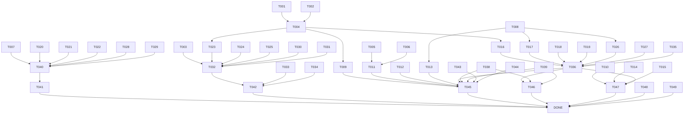

# Tasks: Unify Subscriptions

**Input**: Design documents from `/specs/002-unify-subscriptions/`
**Prerequisites**: plan.md (required), spec.md (required for user stories), research.md, data-model.md, contracts/

**Tests**: Tests are NOT included (not explicitly requested in feature specification).

**Organization**: Tasks are grouped by user story to enable independent implementation and testing of each story.

## Format: `[ID] [P?] [Story] Description`

- **[P]**: Can run in parallel (different files, no dependencies)
- **[Story]**: Which user story this task belongs to (US1, US2, US3)
- Include exact file paths in descriptions.

---

## Phase 1: Setup (Shared Infrastructure)

**Purpose**: Project initialization and basic structure

- [x] T001 Create `Domain/Features/Subscriptions/Enums/SubscriptionType.cs` with Driver=1, Passenger=2
- [x] T002 [P] Update `Domain/Subscriptions/Enums/SubscriptionStatus.cs` to add PaymentFailed = 7
- [x] T003 [P] Read `Infrastructure/Data/Postgreesql/Migrations/20250901000000_AddDriverSubscriptionsTable.cs` to understand old migration structure

---

## Phase 2: Foundational (Blocking Prerequisites)

**Purpose**: Core infrastructure that MUST be complete before ANY user story can be implemented

**⚠️ CRITICAL**: No user story work can begin until this phase is complete.

- [x] T004 Update `Domain/Features/Subscriptions/Entities/Subscription.cs` to add properties: SubscriptionType, AsaasPaymentId, AsaasPaymentLink, AsaasSubscriptionId, PaidAt
- [x] T005 [P] Update `Subscription.cs` Create() method to accept SubscriptionType parameter
- [x] T006 [P] Add methods to `Subscription.cs`: SetSubscriptionType(), SetAsaasPaymentId(), SetAsaasPaymentLink(), SetAsaasSubscriptionId(), SetPaidAt()
- [x] T007 Remove `Domain/Features/Subscriptions/Entities/DriverSubscription.cs` (old entity)
- [x] T008 Update `Domain/Features/Subscriptions/Repository/ISubscriptionRepository.cs` to include all methods from IDriverSubscriptionRepository

**Checkpoint**: Foundation ready - user story implementation can now begin in parallel.

---

## Phase 3: User Story 1 - Unify Subscription Model (Priority: P1) 🎯 MVP

**Goal**: Consolidate the subscription model by removing DriverSubscription and keeping only Subscription with all properties preserved.

**Independent Test**: Verify all Subscription operations work with unified model and no DriverSubscription references remain.

### Implementation for User Story 1

- [x] T009 [P] [US1] Update `Application/Features/Subscriptions/Contracts/SubscriptionResponse.cs` to include new properties (SubscriptionType, AsaasPaymentId, AsaasPaymentLink, AsaasSubscriptionId, PaidAt)
- [x] T010 [P] [US1] Update implicit conversion in `SubscriptionResponse.cs` to map new properties from Subscription entity
- [x] T011 [US1] Update `Application/Features/Subscriptions/Commands/CreateSubscription/CreateSubscriptionCommand.cs` to use Subscription (not DriverSubscription) and accept SubscriptionType
- [x] T012 [US1] Update `CreateSubscriptionCommandValidator.cs` to validate SubscriptionType is "Driver" or "Passenger"
- [x] T013 [US1] Update `CreateSubscriptionCommandHandler.cs` to use ISubscriptionRepository and handle new properties
- [x] T014 [US1] Update `Application/Features/Subscriptions/Queries/GetSubscription/GetSubscriptionQuery.cs` to use Subscription entity
- [x] T015 [US1] Update `GetSubscriptionQueryHandler.cs` to use ISubscriptionRepository and return SubscriptionResponse with all properties

**Checkpoint**: At this point, User Story 1 should be fully functional and testable independently.

---

## Phase 4: User Story 2 - Update Application Layer (Priority: P2)

**Goal**: Update all application layer components to use unified Subscription entity.

**Independent Test**: Run all subscription-related use cases and verify they work correctly with Subscription entity.

### Implementation for User Story 2

- [x] T016 [P] [US2] Update `Application/Features/Subscriptions/Commands/ActivateSubscription/ActivateSubscriptionCommand.cs` to use Subscription (not DriverSubscription)
- [x] T017 [P] [US2] Update `ActivateSubscriptionCommandHandler.cs` to use ISubscriptionRepository
- [x] T018 [P] [US2] Update `Application/Features/Subscriptions/Commands/CancelSubscription/CancelSubscriptionCommand.cs` to use Subscription
- [x] T019 [P] [US2] Update `CancelSubscriptionCommandHandler.cs` to use ISubscriptionRepository
- [x] T020 [US2] Remove `Application/Features/Subscriptions/Commands/CreateDriverSubscription/` folder (if exists)
- [x] T021 [US2] Remove `Application/Features/Subscriptions/Queries/GetDriverSubscription/` folder (if exists)
- [x] T022 [US2] Update all remaining Commands/Queries in `Application/Features/Subscriptions/` to use Subscription instead of DriverSubscription

**Checkpoint**: At this point, User Stories 1 AND 2 should both work independently.

---

## Phase 5: User Story 3 - Update Infrastructure Layer (Priority: P3)

**Goal**: Update infrastructure layer to work with unified Subscription entity.

**Independent Test**: Verify database operations work correctly with Subscription entity and DbContext no longer references DriverSubscription.

### Implementation for User Story 3

- [x] T023 [P] [US3] Update `Infrastructure/Data/Postgreesql/Features/Subscriptions/Configurations/SubscriptionConfiguration.cs` to include new properties mapping
- [x] T024 [P] [US3] Add unique index in `SubscriptionConfiguration.cs` for (UserId, SubscriptionType) for active subscriptions
- [x] T025 [P] [US3] Set default value "Driver" for SubscriptionType column in configuration
- [x] T026 [US3] Update `Infrastructure/Data/Postgreesql/Features/Subscriptions/Repository/SubscriptionRepository.cs` to implement ISubscriptionRepository
- [x] T027 [US3] Add `GetActiveSubscriptionByUserAndType()` method to SubscriptionRepository
- [x] T028 [US3] Remove `Infrastructure/Data/Postgreesql/Features/Subscriptions/Configurations/DriverSubscriptionConfiguration.cs`
- [x] T029 [US3] Remove `Infrastructure/Data/Postgreesql/Features/Subscriptions/Repository/DriverSubscriptionRepository.cs`
- [x] T030 [US3] Update `Infrastructure/Data/Postgreesql/TILTContext.cs` to remove DbSet<DriverSubscription>
- [x] T031 [US3] Ensure `DbSet<Subscription> Subscriptions` is properly configured in TILTContext
- [x] T032 [US3] Create new migration: `dotnet ef migrations add AddSubscriptionUnificationColumns` (from Infrastructure project)
- [x] T033 [US3] Review migration to ensure it adds columns to existing `subscriptions` table (not create new table)
- [x] T034 [US3] Apply migration: `dotnet ef database update` to add columns to database
- [x] T035 [US3] Update `Infrastructure/Shared/Configurations/DependencyInjection.cs` to replace IDriverSubscriptionRepository → ISubscriptionRepository

**Checkpoint**: All user stories should now be independently functional.

---

## Phase 6: API Layer Updates (Priority: P4)

**Goal**: Update API endpoints to use unified Subscription commands/queries.

**Independent Test**: Test all subscription endpoints work correctly with unified model.

### Implementation for API Layer

- [x] T036 [P] Update `Api/Endpoints/SubscriptionEndpoint.cs` to use Subscription commands/queries (not DriverSubscription)
- [x] T037 [P] Update route mappings in `SubscriptionEndpoint.cs` (remove /driver routes if needed)
- [x] T038 [US1] Update `Api/Endpoints/WebhookEndpoint.cs` to use Subscription instead of DriverSubscription
- [x] T039 [US1] Update `Application/Shared/Abstractions/IDriverPaymentService.cs` to use Subscription parameter (consider renaming to ISubscriptionPaymentService)

---

## Phase 7: Polish & Cross-Cutting Concerns

**Goal**: Final cleanup and validation.

- [x] T040 [P] Search entire codebase for "DriverSubscription" and ensure no references remain (except in specs/docs)
- [x] T041 [P] Run `dotnet build` and ensure solution compiles without errors
- [x] T042 Verify new columns exist in database: connect to PostgreSQL and check `tilt.subscriptions` table
- [x] T043 [P] Verify SubscriptionType enum works correctly (Driver=1, Passenger=2)
- [x] T044 Verify SubscriptionStatus enum has PaymentFailed value
- [x] T045 [P] Test POST `/subscriptions` endpoint with SubscriptionType="Driver"
- [x] T046 Test POST `/subscriptions` endpoint with SubscriptionType="Passenger"
- [x] T047 Test GET `/subscriptions/{id}` returns all properties including new ones
- [x] T048 [P] Remove old migration file: `Infrastructure/Data/Postgreesql/Migrations/20250901000000_AddDriverSubscriptionsTable.cs`
- [x] T049 Update `.github/copilot-instructions.md` to reflect unified Subscription model (if needed)

---

## Dependencies Graph



---

## Parallel Execution Examples

### User Story 1 (US1) - Can run in parallel:
```
T009, T010, T011, T012, T013, T014, T015
```

### User Story 2 (US2) - Can run in parallel (after US1):
```
T016, T017, T018, T019, T020, T021, T022
```

### User Story 3 (US3) - Can run in parallel (after Foundation):
```
T023, T024, T025, T026, T027, T028, T029, T030, T031
```

### API Layer - Can run in parallel (after US2 and US3):
```
T036, T037, T038, T039
```

### Polish - Can run in parallel:
```
T040, T041, T042, T043, T044, T045, T046, T047, T048, T049
```

---

## Implementation Strategy

1. **MVP First**: Complete Phase 3 (User Story 1) first - this delivers the core unification
2. **Incremental Delivery**: Each user story is independently testable
3. **Parallel Execution**: Within each phase, tasks marked [P] can be done simultaneously
4. **Validation**: After each phase, verify the checkpoint criteria are met
5. **Cleanup Last**: Phase 7 ensures no references to old entity remain.

---

## Summary

| Phase | Story | Task Count | Parallel Opportunities |
|-------|-------|------------|------------------------|
| Phase 1: Setup | N/A | 3 | 2 tasks [P] |
| Phase 2: Foundational | N/A | 5 | 3 tasks [P] |
| Phase 3: US1 | Unify Model (P1) | 7 | 2 tasks [P] |
| Phase 4: US2 | Update App Layer (P2) | 7 | 6 tasks [P] |
| Phase 5: US3 | Update Infra Layer (P3) | 13 | 5 tasks [P] |
| Phase 6: API | N/A | 4 | 2 tasks [P] |
| Phase 7: Polish | N/A | 10 | 6 tasks [P] |
| **TOTAL** | **3 Stories** | **49 tasks** | **24 parallel tasks** |

---

## Format Validation

✅ ALL tasks follow the checklist format: `- [ ] Txxx [P?] [Story?] Description with file path`
✅ Task IDs are sequential (T001-T049)
✅ [P] marker used for parallelizable tasks
✅ [Story] label used for US1, US2, US3 phases
✅ Setup/Foundational/Polish phases have NO story label
✅ Each task includes exact file path
✅ Dependencies graph shows story completion order
